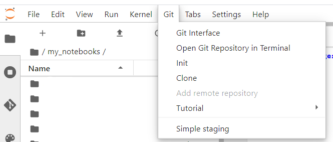
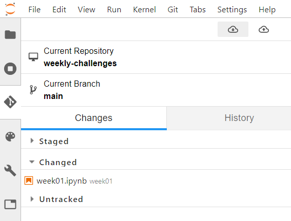

# DAG Weekly Challenges (Spring 20212

Welcome to the weekly challenges of the <a href="https://dag-epfl.ch/">Data Analytics Group</a> at EPFL!

## How to do the challenges

We will provide the challenges as <a href="https://jupyter.org/">Jupyter</a> notebooks containing the instructions, the boilerplate code to load a dataset (if applicable) and a submission link for your solution.

Here are a few possible options to do the challenges if it's your first time using Jupyter notebooks:
  - Use [Noto](#noto), EPFL's JupyterLab platform.
  - Use [Google Colab](#google-colab), a similar solution to Noto, but with free access to GPUs for heavier tasks.
  - Install [your own local environment](#your-own-local-environment).
  - Of course, you can also transpose the problems into the programming language and/or IDE of your choice!

### Noto

<a href="https://noto.epfl.ch">Noto</a> is EPFL's JupyterLab platform that allows teachers and students to use Jupyter notebooks without having to install anything on their computer.

1. Sign in to [https://noto.epfl.ch](https://noto.epfl.ch).
2. From the Noto main screen, you can clone this repository by selecting Git > Clone and entering https://github.com/DAG-EPFL/weekly-challenges-21-fall.git.

3. Enter the created directory and start coding!
4. We will release new challenges every week. In order to get them, select the *Git* tab in the left toolbar and press the *Pull* button (cloud with the arrow pointing downwards, highlighted in gray below).

### Google Colab

Google's  is a similar solution to Noto.

1. Sign in to [https://colab.research.google.com](https://colab.research.google.com).
2. When prompted which file to open, select the *GitHub* tab and enter https://github.com/DAG-EPFL/weekly-challenges-21-fall as the GitHub URL. You will be able to select which notebook you want to open.
3. Start coding!
4. We will release new challenges every week. In order to get them, open a new notebook and follow the steps above to select an other challenge.

### Your own local environment

Install your own local environment with <a href="https://docs.conda.io/en/latest/">conda</a> and edit the notebooks locally. This could be useful for future projects if you haven't done it yet!

Once conda is installed, you can either perform a simple manual setup with "standard" libraries (numpy, scipy, matplotlib, seaborn, pandas, scikit-learn, ipython...), or automatically create a virtual environment using the provided [environment.yml](environment.yml) file:

1. In the root directory containing the challenges, run `conda env create -f environment.yml` to create the environment (named `dag` by default).
2. Run `conda activate dag` to activate the environment.
3. Run `ipython kernel install --user --name=dag` to make the new `dag` environment visible as a kernel in Jupyter.
4. Run `jupyter notebook` to launch Juptyer, open the challenge notebook and select the `dag` kernel under `Kernel > Change kernel`.

 See this <a href="https://docs.conda.io/projects/conda/en/latest/user-guide/tasks/manage-environments.html#creating-an-environment-from-an-environment-yml-file">link</a> for more information on conda environments.

